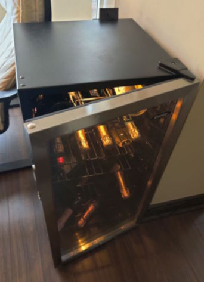
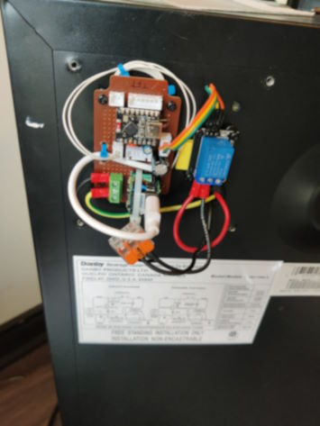
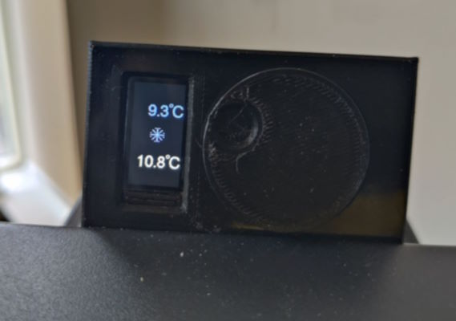

# Danby Fridge Microcontroller Project

I upcycled an old Danby Fridge, replacing the broken thermostat with an ESP32-C3,
a thermistor for temperature monitoring, and a relay to control the compressor.

 

This was also an experiment in AI programming, as the initial skeleton and various
refinements were managed using VS Code + Cline and the gpt-5-mini model, along with
some reviews using Copilot GPT-5.

# User Interface

Use the dial to set the target temperature, shown in blue at the top. The temperature
at the bottom is the current reading from the thermistor. Press and hold the dial
to switch between Fahrenheit and Celsius.

The snowflake will render when the compressor is actively running, although you can
typically hear it anyway.

# Features

 * Switching between Celsius and Fahrenheit
 * Hysterisis around target temperature
 * Compressor minimum off time to increase longevity of the PTC starter
 * Ratiometric averaging of ADC readings to factor out supply voltage fluctiations
 * Moving averages and dead times to handle ESP32 ADC inaccuracies
 * Periodic state saving only when changes occurred to save on writes

# Design Notes and the AI experience

Using AI for programming can be simultaneously frustrating and humbling. It does a reasonably
good job at following instructions and the code quality is decent, but sometimes we can fall
into rabbit holes without end.

Getting the RMT code working turned out to be futile, but it was never clear whether this was
an issue with the code or the sensor, so I eventually abandoned it for a simple thermistor. I
later discovered a library that does the RMT so maybe I'll try that some day.

There were a few humblind situations where the AI told me of specific issues with
a piece of code, and I thought I had ruled them out, but I'm sometimes not as clever and thorough
as I think.

The `async.h` and `rotary.h` are reusable, standalone headers from my [embedded](https://github.com/naasking/embedded)
repository. They simplified the code a lot, and I was able to easily tell GPT-5 to rewrite
some of the code using these headers. It also suggested a few refinements to the headers
which then made it upstream. Neat.

# Future Work

## Microcontroller Sleep

I had started with the intention of putting the microcontroller into low power mode
and only powering it up to take measurements every 5 seconds or so. However, I ran into
many difficulties getting RMT to work with the DHT22 sensor I initially started with,
so I disabled a lot of this functionality to try to narrow down the issues I was having
and never got around to adding this back.

## Refactoring

There are a lot of static variables, which limits how you can reuse this code for
different types of fridges. For instance, dual zone wine fridges require multiple
thermistors and multiple relays, which isn't easy with the current code.

All of the static variables should be refactored into structs and initialized in
static arrays whose sizes are set by compile-time constants. This would let the
code scale.